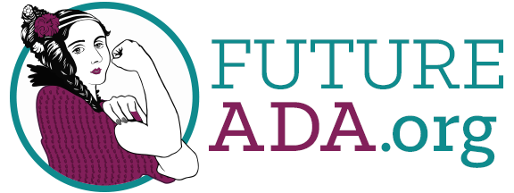

# Code of Conduct #

## Quick Version ##

We believe in being inclusive, welcoming, and supportive of anyone who comes to us with good faith and the desire to build a community, regardless of gender and gender-identity, sexual orientation, physical appearance, body size, age, disability, nationality, ethnicity, faith, or career path. The strength of our community comes from its varied participants from a wide range of backgrounds. We do not tolerate harassment in our community in any form. Anyone found violating these rules may be sanctioned or expelled at the discretion of the organizers.

We expect everyone who participates in our community for both online and offline events, meetings, or in online forums or other virtual collaboration to follow this code of conduct and promote a safe, inclusive atmosphere. We value your participation and want to ensure everyone has a safe experience.

## Less Quick Version ##

Future Ada is dedicated to providing an inclusive, safe, welcoming, harassment free space where community members feel comfortable participating and being themselves. We do not tolerate harassment of our community members or participants of any form. Anyone found in violation of this policy may be sanctioned or expelled from these spaces at the discretion of the Future Ada Code of Conduct Committee.

Some Future Ada spaces may have additional rules in place which will be made clearly available to participants. This is a living document which will grow and change over time. Community members and participants are responsible for knowing and abiding by these rules.

### Harassment includes but not limited to… ###

* Offensive comments related to gender, gender identity and expression, sexual orientation, disability, mental illness, neuro(a)typicality, physical appearance, body size, age, race, or religion.
* Unwelcome comments regarding a person's lifestyle choices and practices, including those related to food, health, parenting, drugs, and employment.
* Deliberate misgendering or use of “dead” or rejected names.
* Gratuitous or off-topic sexual images or behavior in spaces where they're not appropriate.
* Physical contact and simulated physical contact (e.g. textual descriptions like “hug” or “backrub”) without consent or after a request to stop.
* Threats of violence.
* Incitement of violence towards any individual, including encouraging a person to commit suicide or to engage in self-harm.
* Deliberate intimidation.
* Stalking or following.
* Harassing photography or recording, including logging online activity for harassment purposes.
* Sustained disruption of discussion.
* Unwelcome sexual attention.
* Pattern of inappropriate social contact, such as requesting/assuming inappropriate levels of intimacy with others.
* Continued one-on-one communication after requests to cease.
* Deliberate “outing” of any aspect of a person's identity without their consent.
* Publication of without consent, non-deidentified, non-harassing private communication.

### How to report ###
If you have been harassed or believe the code of conduct has been violated in some manner by another participant, volunteer or organizer, you may safely report it via emailing [codeofconduct@futureada.org](mailto:codeofconduct@futureada.org). We have our Code of Conduct Committee reviewing any and all reports. If the person in question is one of the organizers or on the Code of Conduct Committee, they will recuse themselves from handling your incident.

In order to protect volunteers from abuse and burnout, we reserve the right to reject any report we believe to have been made in bad faith. The Future Ada Code of Conduct Committee is not here to explain power differentials or other basic social justice concepts to you. Reports intended to silence legitimate criticism may be closed without response.

### Consequences ###

Participants or community members asked to stop any harassing behavior are expected to comply immediately.

If a participant or community member engages in harassing behavior, the Future Ada Code of Conduct Committee may take any action they deem appropriate, up to and including expulsion from all Future Ada online spaces, exclusion from all future office events and meetings, and identification of the participant or community member as a harasser to other Future Ada community members or the general public.

## Credits ##

This policy was inspired by the following sources:
 
* [Geek Feminism](https://geekfeminism.org/about/code-of-conduct/)
* [Write/Speak/Code](http://www.writespeakcode.com/code-of-conduct.html) 
* [DjangoConUS](https://2017.djangocon.us/coc/)
* [Django Girls Code of Conduct](https://djangogirls.org/coc/)
* [TTS Code of Conduct](https://github.com/18F/code-of-conduct) 

